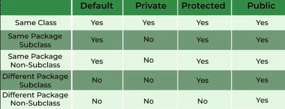

<h1>4 tính chất của OOP</h1>

<h3>Tính đóng gói (Encapsulation)</h3> Sử dụng các từ khoá <strong>public, private, protected</strong> 
chỉ định phạm vi truy cập của các thuộc tính và phương thức qua đó nhằm bảo mật thông tin trong class.
 

<h3>Tính kế thừa (Inheritance)</h3> Lớp con có thể kế thừa các thuộc tính và phương thức của lớp cha, 
có thể chỉnh sửa và phát triển các thuộc tính và phương thức đó, sử dụng từ khoá <strong>extends</strong>.
 
<h3>Tính đa hình (Polymorphism)</h3> Gồm 2 khái niệm ghi đè phương thức <strong>overriding method</strong> giúp lớp con có thể định nghĩa lại phương thức được kế thừa từ lớp cha, 
nạp chồng phương thức <strong>overloading method</strong> nghĩa là trong 1 lớp các phương thức có thể định nghĩa cùng tên nhưng khác tham số truyền vào.
 
<h3>Tính trừu tượng (Abstraction)</h3> Gồm khái niệm <strong>abstract class</strong> dùng để tạo ra khuôn mẫu chữa những thuộc tính và phương thức ảo (abstract method) 
mà những class kế thừ bắt buộc phải có mà các class kế thừa có thể định nghĩa lại và sử dụng chúng;
<strong>Interface</strong> tương tự abstract class nhưng mức đồ trừu tượng cao hơn (các thuộc tính phải là hằng chứa giá trị và các phương thức bên trong được mặc định là abstract method).
 
<h1>Constructors</h1>
<h3>Hàm khởi tạo (Constructors)</h3> Dùng để khởi tạo nhanh các thuộc tính khi khai báo đối tượng
